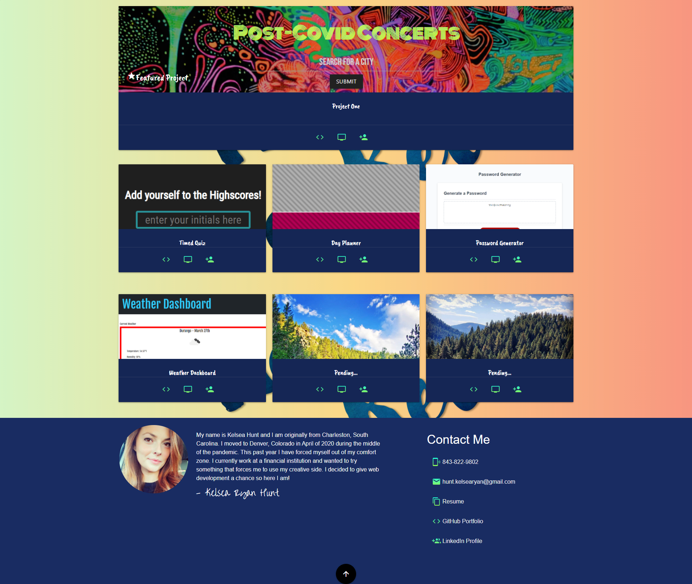

# House of Kel Portfolio

In order to be employer competitive by the end of this program, we were tasked to update our portfolio with new projects.  We completed our first group project last week and have had some more practice with our homework assignments.

#  What did I Showcase?

I decided to show off our group project that we completed that utilizes 2 Web API's to search for concerts in a city.  The other homework assignments that I decided to include were the Timed Quiz, Day Planner, Password Generator and the Weather Dashboard.

# Built With:
1. HTML
2. Materialize CSS

# How my Portfolio Reacts to its User

# Image of my Portfolio

# Check out my live Portfolio!

https://k-ryanhunt.github.io/Working-Portfolio-Version-2/

# License

# Contact Me:

* Phone 843-822-9802
* Email hunt.kelsearyan@gmail.com
* LinkedIn https://www.linkedin.com/in/k-ryanhunt/